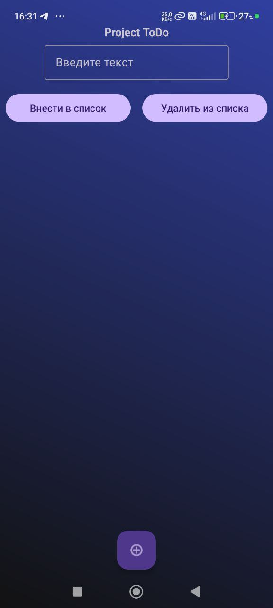
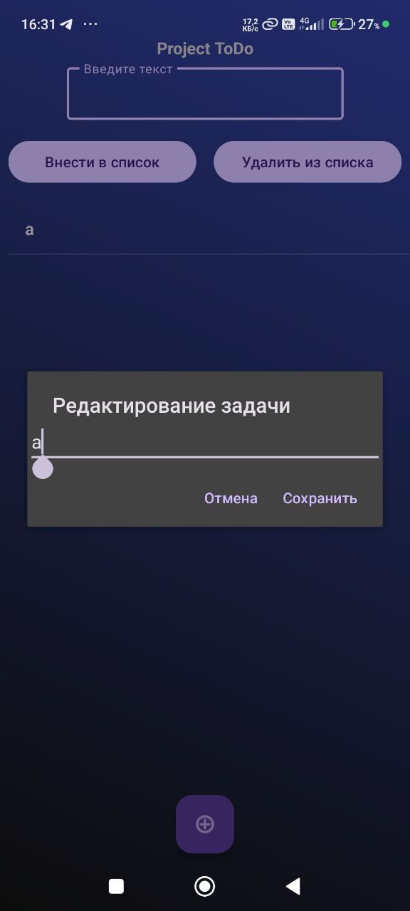

# ToDo App
## Это showcase pet проект для обучения
## Описание
Приложение "ToDo" — это простой менеджер задач, который позволяет пользователям добавлять, удалять и редактировать задачи. Приложение использует базу данных SQLite для сохранения данных между сессиями.

---

## Функциональность
- **Добавление задач:** Пользователи могут вводить новые задачи.
- **Удаление задач:** Задачи можно удалить через кнопку или долгое нажатие.
- **Редактирование задач:** Пользователи могут изменять текст существующих задач.
- **Сохранение данных:** Все задачи сохраняются в локальной базе данных SQLite даже после закрытия приложения.

---

## Технологии
- **Язык программирования:** Kotlin
- **База данных:** SQLite (через `SQLiteOpenHelper`)
- **UI компоненты:** `ConstraintLayout`, `ListView`, `EditText`, `Button`
- **Архитектура:** Простая архитектура без использования MVVM или других паттернов (можно доработать в будущем).
- **Android SDK:** Минимальная версия SDK: API 21 (Android 5.0)

---

## Скриншоты


*Экран с добавлением и отображением задач.*


*Диалоговое окно для редактирования задачи.*

---

## Установка

### Предварительные требования:
- Android Studio (версия 4.0 или выше)
- Java Development Kit (JDK) 8 или выше
- Устройство или эмулятор с Android 5.0 (API 21) или выше

### Инструкции:
1. Клонируйте репозиторий:
   ```bash
   git clone https://github.com/Ivansups/ToDo
2. Откройте проект в Android Studio: Импортируйте проект из клонированной директории.
3. Настройте токены или конфигурации (если они есть): В данном проекте дополнительная настройка не требуется.
4. Скомпилируйте и запустите приложение: Подключите устройство или запустите эмулятор. Нажмите кнопку "Run" в Android Studio.
   
---

## Как использовать
1. Добавление задачи:
- Введите текст в поле ввода.
- Нажмите кнопку "Добавить".
2. Удаление задачи:
- Выберите задачу из списка.
- Нажмите кнопку "Удалить выбранное".
- Альтернативно: сделайте долгое нажатие на задачу.
3. Редактирование задачи:
- Сделайте долгое нажатие на задачу.
- В диалоговом окне измените текст и нажмите "Сохранить".
  
---

## Архитектура проекта
Проект организован следующим образом:
- MainActivity.kt: Главная активность, содержащая логику работы с UI.
- TaskDatabaseHelper.kt: Класс для работы с базой данных SQLite.
- activity_main.xml: Разметка главного экрана.
- res/drawable/: Файлы для фоновых изображений и градиентов.
- res/values/: Строковые ресурсы и цвета.
